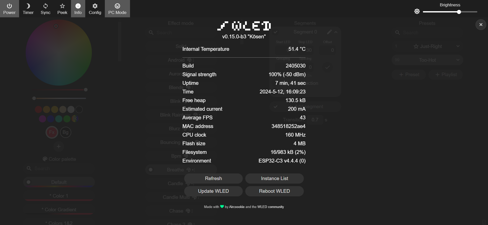

# Internal Temperature Usermod

  

  

## Features
 - &nbsp;🌡️&nbsp; Adds the internal temperature readout of the chip to the Info tab
 - 🥵 High temperature indication/action. (configurable preset and threshold)
 - 📣 Publishes the internal temperature over the MQTT topic: `mcutemp`
  

## Use Examples
- Warn of excessive/damaging temperatures
- Auto-reduce brightness
- Activate a cooling fan 
  (Perhaps used in combination with the multi-relay usermod)
  

## Compatibility
- A shown temp of 53,33°C might indicate that the internal temp is not supported
- ESP8266 does not have a internal temp sensor -> Disabled (Indicated with a readout of '-1')
- ESP32S2 seems to crash on reading the sensor -> Disabled (Indicated with a readout of '-1')
  

## Installation
- Add a build flag `-D USERMOD_INTERNAL_TEMPERATURE` to your `platformio.ini` (or `platformio_override.ini`).
  

## 📝 Change Log

2024-05-11

- Added "high-temperature-indication" feature
- Documentation updated

2023-09-01

* "Internal Temperature" usermod created
  

## Authors
- Soeren Willrodt [@lost-hope](https://github.com/lost-hope)
- Dimitry Zhemkov [@dima-zhemkov](https://github.com/dima-zhemkov)
- Adam Matthews [@adamsthws](https://github.com/adamsthws)
